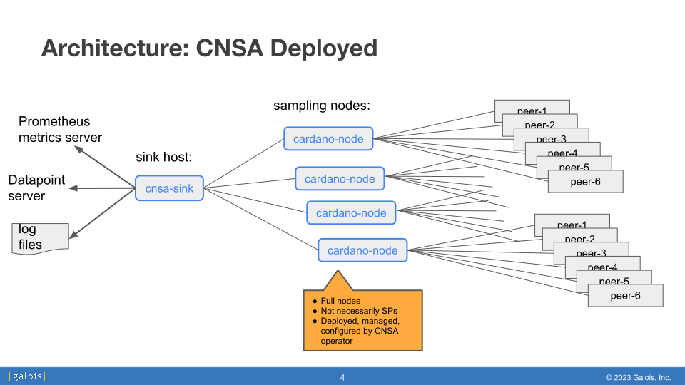
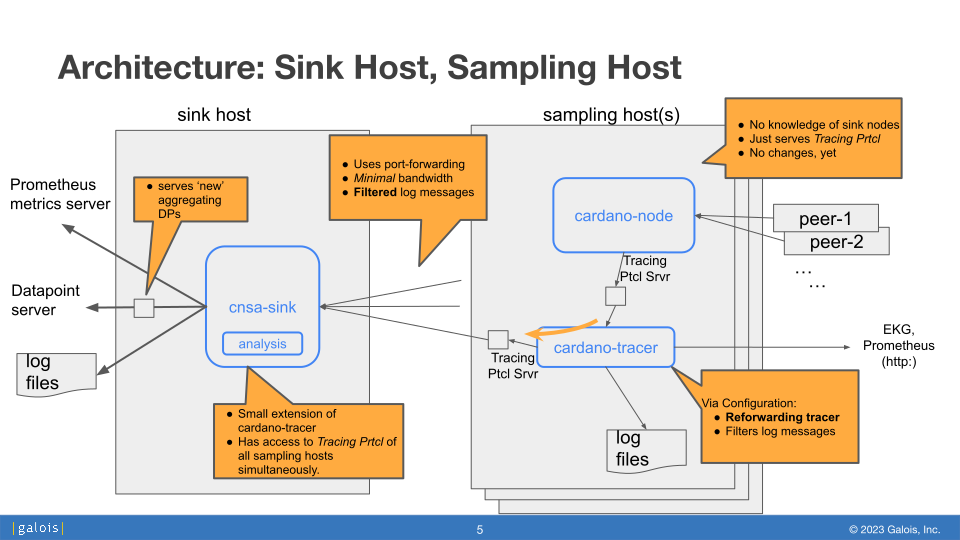

# CNSA Design and Architecture
## CNSA Terminology

First some terminology we use here:

- Consolidation server (or sink node): the host, or service, to which
  all data is sent.  (We will also use the term "sink node", as the
  terms client and server in this context can be confusing: e.g.,
  cardano-node is the "server" for log data.)
- CNSA instance: A set of running sampling nodes that are
  communicating results to the consolidation server.
- CNSA operator: an organization or person that deploys an instance of
  the CNSA framework into the Cardano network.  There can be many such
  operators with instances deployed into the network as these nodes
  have no special privileges or status.
  
## Current Solutions And CNSA

There are many projects and tools similar in goals to CNSA:
 - *Blockchain explorers*, which give an up-to-date view of the
   blockchain and provide information about the health of the
   system. However, blockchain explorers tell us only about the chain
   data itself (transactions, epoch, slot, etc.), but understandably
   tell us nothing about the nodes, the topology, the efficiency of
   the network, of forks, of delays, etc.
- Community provided *stakepool aggregators* allow SPOs to contribute
  real-time monitoring data to an aggregating service. Two examples
  are:
  - blockPerf.sh, a network performance monitoring script developed by
    Markus Gufmar and distributed with the Guild Operators tools, the
    results of this aggregator are displayed at
    https://api.clio.one/blocklog/timeline/.
  - pooltool.io (https://pooltool.io/) gathers network measurements
    using volunteered, real-time data from volunteer SPOs: these SPOs
    regularly send their tips and leader-schedules (safely, each
    epoch).

  These aggregators are similar in spirit to the goals of CNSA and we
  plan to duplicate some of this functionality.  However, CNSA has a
  fundamentally different design principle: it is designed to be
  trust-less, relying only on "self-deployed" nodes which need not be
  stakepools.

- Tools and libraries: Numerous tools and libraries provide varying
  degrees of monitoring, data logging, and rendering capabilities for
  Cardano network monitoring. These tools and libraries are provided
  both by IOG and by third parties (e.g.,
  https://cardano-community.github.io/guild-operators/). However, the
  point of CNSA is to provide a single, efficient, turnkey system by
  which a CNSA operator can easily spin up a set of sampling nodes for
  measuring network properties.  When possible, CNSA will be
  leveraging the existing code, libraries, and tools.

## Design Criteria

Some design criteria currently informing the proposed architecture of CNSA are as follows:
- Be relatively robust with respect to cardano-node major & minor
  version changes;
- Minimize node resources (computation, disk, etc.) on the sampling
  nodes running cardano-node (when possible pushing computation to the
  consolidation-server);
- Minimize network usage between sampling-nodes and
  consolidation-server (which of course may conflict with the previous
  criteria);
- Minimize (or eliminate) changes to the core IOG source code
  (cardano-node in particular); a corollary to this is to re-use
  existing code when possible;
- Be forward-looking: work with "new tracer"; encouraging, not hindering, the migration.
- Sampling nodes need not be stakepool nodes (or even block producing
  nodes);
- It should not be difficult to create a sampling node from a deployed
  node.

## High Level Architecture

The high level architecture of a CNSA instance comprises the following:
- Deploy N "sampling" nodes that sample data from the network (N ≈ 10 ?)
- Each node would be connected to V peers (V ≈ 100 ?)
- Sampling nodes process and send a subset of the data to a
  centralized service (`cnsa-sink` running on the "sink node").
- Centralized service---in real time---aggregates data, runs analyses
  on them, and serves the results via
  - Log files.
  - DataPoints (allows for Haskell programs to read arbitrary
    datatypes over socket).
  - Prometheus  (for “scalar” network metrics).

As is seen here:

## Design of Sink and Sampling Hosts

Here is a diagrammatic overview of the sink host and the sampling hosts:
.

### New Tracing Introduced

Splits cardano-node into two processes
cardano-node (core functionality;  serves tracing protocol)
cardano-tracer (logging, logfile management, EKG, etc.).

The general idea and architecture of cardano-tracer is described here:
https://github.com/input-output-hk/cardano-node/blob/master/cardano-tracer/docs/cardano-tracer.md

Tracing Protocol
1. Logging Messages
2. Forwarding of EKG store (scalar values)
3. DataPoints (newest of these protocols)

### Extending cardano-tracer with Reforwarding

<TODO>

### Further Details

Note the following <TODO>

For yet further details, refer to [Spinning Up and Using CNSA](RunningCNSA.md)
